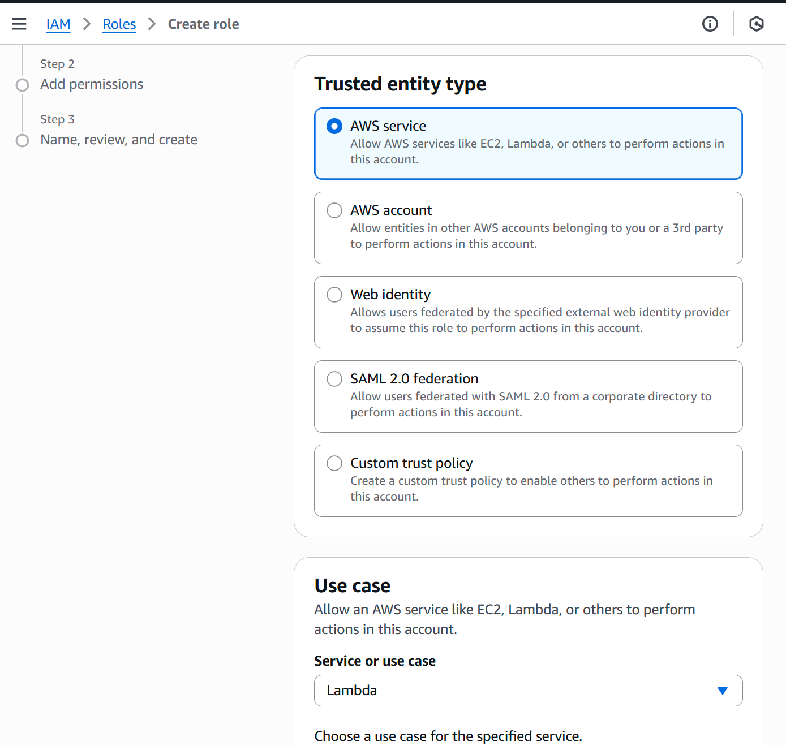
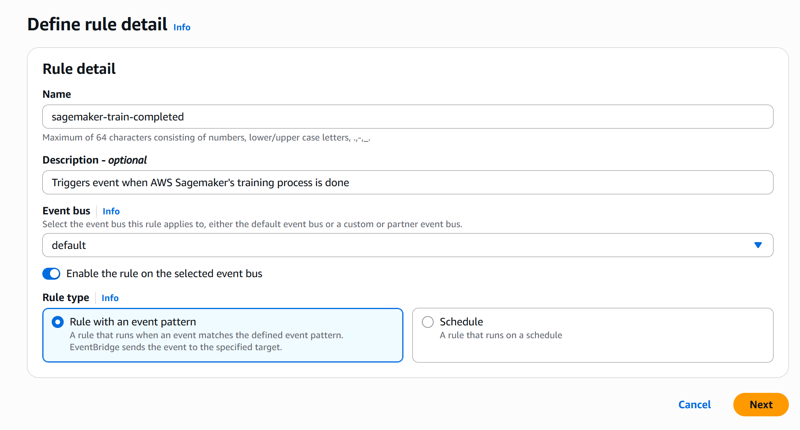
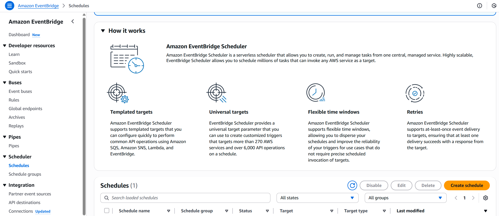
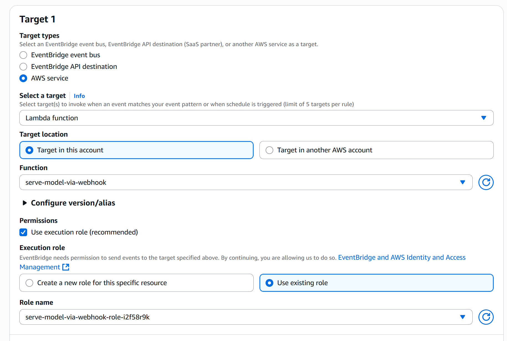

# Bitcoin Price Prediction MLOps Pipeline

> 실시간 비트코인 데이터를 수집하고, 자동으로 모델을 학습·배포하는 End-to-End MLOps 시스템

---

## 목차

1. [프로젝트 개요](#1-프로젝트-개요)
2. [시스템 아키텍처](#2-시스템-아키텍처)
3. [전체 데이터 흐름](#3-전체-데이터-흐름)
4. [컴포넌트 상세](#4-컴포넌트-상세)
   - [4-1. 데이터 수집 — Kafka Producer](#4-1-데이터-수집--kafka-producer)
   - [4-2. 스트리밍 — Kafka + S3 Sink Connector](#4-2-스트리밍--kafka--s3-sink-connector)
   - [4-3. 신호 감지 — AWS Lambda](#4-3-신호-감지--aws-lambda)
   - [4-4. 모델 학습 — AWS SageMaker + MLflow](#4-4-모델-학습--aws-sagemaker--mlflow)
   - [4-5. 모델 서빙 — ONNX / TorchServe](#4-5-모델-서빙--onnx--torchserve)
   - [4-6. 웹 대시보드 — FastAPI + Chart.js](#4-6-웹-대시보드--fastapi--chartjs)
5. [ML 모델 상세](#5-ml-모델-상세)
6. [AWS 인프라 구성](#6-aws-인프라-구성)
7. [컴포넌트 간 통신 구조](#7-컴포넌트-간-통신-구조)
8. [디렉토리 구조](#8-디렉토리-구조)
9. [기술 스택](#9-기술-스택)
10. [실행 방법](#10-실행-방법)
11. [팀 역할 분담](#11-팀-역할-분담)

---

## 1. 프로젝트 개요

### 목표

Binance API에서 비트코인(BTC/USDT) 1분봉 데이터를 **실시간으로 수집**하고, 시장 신호가 감지될 때 **자동으로 모델을 재학습**하여, 웹 대시보드에서 **다음 가격을 예측**하는 완전 자동화 MLOps 파이프라인 구축

### 핵심 특징

| 특징 | 설명 |
|------|------|
| **실시간 데이터 수집** | Binance API → Kafka Producer → S3 (5초 단위 폴링) |
| **이벤트 기반 자동 학습** | 골든 크로스 / 거래량 급증 신호 감지 시 SageMaker 재학습 자동 트리거 |
| **자동화 스케줄링** | EventBridge로 하루 6회 Lambda 실행 |
| **실험 추적** | MLflow로 학습 메트릭 및 모델 아티팩트 관리 |
| **경량 추론 서빙** | ONNX Runtime 기반 빠른 추론 |
| **웹 대시보드** | 실시간 가격 차트 + 모델 예측값 시각화 (60초 자동 갱신) |

---

## 2. 시스템 아키텍처


```
┌─────────────────────────────────────────────────────────────────────┐
│                         DATA INGESTION                              │
│                                                                     │
│   Binance API  ──►  Kafka Producer  ──►  Kafka Topic               │
│   (1분봉 OHLCV)      (5초 폴링)          btc_1m_kline_structured   │
└────────────────────────────┬────────────────────────────────────────┘
                             │
                             ▼
┌─────────────────────────────────────────────────────────────────────┐
│                       STREAM PROCESSING                             │
│                                                                     │
│   Kafka Connect  ──►  S3 Sink Connector  ──►  AWS S3               │
│   (JSON 형식)          (날짜별 파티셔닝)        ybigta-crypto-price  │
└────────────────────────────┬────────────────────────────────────────┘
                             │
                             ▼
┌─────────────────────────────────────────────────────────────────────┐
│                    AUTOMATED ML PIPELINE                            │
│                                                                     │
│  EventBridge (6회/일)  ──►  Lambda (신호 감지)                      │
│                                │                                    │
│                    골든크로스 or 거래량 급증 감지                    │
│                                │                                    │
│                                ▼                                    │
│                    SageMaker Training Job                           │
│                    (NLinear 모델 학습)                               │
│                                │                                    │
│                                ▼                                    │
│                    MLflow 실험 추적 + S3 모델 저장                   │
└────────────────────────────┬────────────────────────────────────────┘
                             │
                             ▼
┌─────────────────────────────────────────────────────────────────────┐
│                         MODEL SERVING                               │
│                                                                     │
│   ONNX Runtime Server  ─┐                                          │
│   (FastAPI, 추론 API)    ├──►  Web Dashboard (FastAPI + Chart.js)  │
│   TorchServe            ─┘     실시간 가격 + 예측값 표시            │
└─────────────────────────────────────────────────────────────────────┘
```

---

## 3. 전체 데이터 흐름

```
① Binance API
        │  1분봉 OHLCV 데이터 (5초마다 폴링)
        ▼
② Kafka Producer
        │  Topic: btc_1m_kline_structured
        │  Fields: open_time, open, high, low, close, volume, ...
        ▼
③ Kafka Broker (Docker Compose)
        │  메시지 큐잉 및 버퍼링
        ▼
④ Kafka Connect + S3 Sink Connector
        │  JSON 형식, 날짜 파티셔닝 (Asia/Seoul)
        │  3개 메시지마다 S3 플러시
        ▼
⑤ AWS S3
        │  s3://ybigta-crypto-price/topics/btc_1m_kline_structured/YYYY-MM-dd/
        ▼
⑥ EventBridge (스케줄: 0, 4, 8, 12, 16, 20시 KST)
        │  Lambda 함수 트리거 (하루 6회)
        ▼
⑦ AWS Lambda (signal.py)
        │  최근 4시간 S3 데이터 읽기
        │  신호 감지:
        │    - Golden Cross: MA30 > MA120
        │    - Volume Surge: Z-score(거래량) > 2.5
        ▼ (신호 감지 시에만)
⑧ SageMaker Training Job
        │  S3에서 Feature 파일 로드
        │  NLinear 모델 학습 (24 timesteps × 5 features → 1 output)
        │  MLflow에 Loss 메트릭 & 모델 아티팩트 로깅
        │  model.pth → S3 저장
        ▼
⑨ ONNX 모델 변환 & 배포
        │  model.pth → model.onnx
        │  ONNX Runtime 서버에 핫 로드
        ▼
⑩ Web Dashboard (60초 자동 갱신)
        │  GET /api/bitcoin    → Binance 현재 가격 조회
        │  POST /api/predict   → ONNX 모델 다음 가격 예측
        │  GET /api/model-info → 학습 시각 표시
        ▼
⑪ 사용자 브라우저
        실시간 가격 차트 + 모델 예측값 확인
```

---

## 4. 컴포넌트 상세

### 4-1. 데이터 수집 — Kafka Producer

**경로:** `src/bitcoin-kafka-s3_connector/`

Binance API에서 BTC/USDT 1분봉 캔들 데이터를 **5초마다 폴링**하여 Kafka 토픽에 발행합니다.

**수집 데이터 필드:**

| 필드 | 설명 |
|------|------|
| `open_time` | 캔들 시작 시간 (Unix ms) |
| `open` | 시가 |
| `high` | 고가 |
| `low` | 저가 |
| `close` | 종가 |
| `volume` | 거래량 |
| `quote_asset_volume` | Quote 자산 거래량 |
| `number_of_trades` | 체결 건수 |

**Docker Compose 구성:**

```yaml
services:
  zookeeper:   # Kafka 코디네이터
  broker:      # Kafka 브로커 (포트 9092)
  producer:    # BTC 데이터 수집기 (Binance API 폴링)
  connect:     # Kafka Connect 워커 (S3 Sink)
```

---

### 4-2. 스트리밍 — Kafka + S3 Sink Connector

**경로:** `src/bitcoin-kafka-s3_connector/connect/connectors/s3-link.json`

Confluent S3 Sink Connector를 통해 Kafka 토픽 데이터를 AWS S3에 자동 저장합니다.

**주요 설정:**

```json
{
  "connector.class": "io.confluent.connect.s3.S3SinkConnector",
  "topics": "btc_1m_kline_structured",
  "s3.bucket.name": "ybigta-crypto-price",
  "s3.region": "ap-northeast-2",
  "flush.size": "3",
  "format.class": "io.confluent.connect.s3.format.json.JsonFormat",
  "partitioner.class": "TimeBasedPartitioner",
  "path.format": "'year'=YYYY/'month'=MM/'day'=dd",
  "timezone": "Asia/Seoul"
}
```

**S3 저장 경로:**
```
s3://ybigta-crypto-price/
└── topics/
    └── btc_1m_kline_structured/
        └── YYYY-MM-dd/
            └── btc_1m_kline_structured+0+000000000.json
```

---

### 4-3. 신호 감지 — AWS Lambda

**경로:** `lambda/signal.py`

EventBridge로 하루 6회 실행되며, S3에서 최근 4시간 데이터를 읽어 학습 트리거 여부를 판단합니다.

**감지 신호:**

| 신호 | 조건 | 의미 |
|------|------|------|
| **Golden Cross** | MA30 > MA120 | 단기 이평선이 장기 이평선 상향 돌파 (상승 추세 전환 신호) |
| **Volume Surge** | Z-score(거래량) > 2.5 | 평균 대비 거래량 급증 (시장 변동성 확대) |

**동작 흐름:**

```python
# 1. S3에서 최근 4시간 데이터 로드
data = load_s3_data(bucket, prefix, dates)

# 2. 이동평균 계산
ma30  = close_prices.rolling(30).mean()
ma120 = close_prices.rolling(120).mean()

# 3. 신호 감지
golden_cross = (ma30.iloc[-1] > ma120.iloc[-1])
volume_surge = (zscore(volumes) > 2.5).any()

# 4. 신호 있으면 SageMaker 학습 트리거
if golden_cross or volume_surge:
    trigger_sagemaker_training()
```

**Lambda 설정:**


**필요 IAM 권한:**



| 서비스 | 권한 |
|--------|------|
| S3 | `GetObject`, `ListBucket` |
| SageMaker | `CreateTrainingJob`, `DescribeTrainingJob` |
| CloudWatch Logs | `CreateLogGroup`, `PutLogEvents` |

---

### 4-4. 모델 학습 — AWS SageMaker + MLflow

**경로:** `src/train/`

Lambda 신호 감지 시 SageMaker Training Job이 자동 실행됩니다.

**학습 파이프라인:**

```
S3 Feature 파일 로드 (JSON 형식)
        ↓
DataLoader 구성 (batch_size=16, shuffle=True)
        ↓
NLinear 모델 학습 (10 epochs, MSELoss, Adam)
        ↓
MLflow에 epoch별 Loss 메트릭 로깅
        ↓
model.pth → S3(/opt/ml/model/) 저장
```

**학습 하이퍼파라미터:**

| 파라미터 | 값 |
|----------|-----|
| Optimizer | Adam (lr=0.001) |
| Loss Function | MSELoss |
| Epochs | 10 |
| Batch Size | 16 |
| Input Shape | `(batch, 24, 5)` |
| Output Shape | `(batch, 1)` |
| Framework | PyTorch 2.2.0 (CUDA 11.8) |

**EventBridge → SageMaker 연동:**






---

### 4-5. 모델 서빙 — ONNX / TorchServe

#### ONNX Runtime Server

**경로:** `onnx/server.py`

FastAPI 기반으로 ONNX 모델을 로드하여 추론 API를 제공합니다.

```
POST /predict
  Input:  { "input": [[...24×5 행렬...]] }
  Output: { "output": [예측 종가] }
```

- `onnxruntime.InferenceSession`으로 모델 로드
- 동적 배치 크기 지원
- `POST /upload_model`로 새 ONNX 모델 핫 스왑 가능

#### TorchServe

**경로:** `torchserve/`

PyTorch 네이티브 서빙 솔루션으로, 커스텀 핸들러를 통해 전처리 및 추론을 수행합니다.

| 포트 | 용도 |
|------|------|
| 8080 | 추론 (Inference Endpoint) |
| 8081 | 관리 (Management API) |

---

### 4-6. 웹 대시보드 — FastAPI + Chart.js

**경로:** `web/`

**API 엔드포인트:**

| 메서드 | 경로 | 기능 |
|--------|------|------|
| `GET` | `/api/bitcoin` | Binance에서 최근 3시간 1분봉 데이터 조회 |
| `POST` | `/api/predict` | ONNX 모델로 다음 가격 예측 (24×5 입력 → 예측가) |
| `GET` | `/api/model-info` | 모델 마지막 학습 시각 및 로드 상태 |
| `POST` | `/api/upload_model` | ONNX 모델 파일 업로드 및 핫 로드 |

**대시보드 UI 구성:**

```
┌──────────────────────────────────────────────────────┐
│                                                      │
│   [ Bitcoin Price Chart — 최근 3시간 1분봉 ]          │
│   (Chart.js 라인 차트, 타임스탬프 × 종가)             │
│                                                      │
│   현재 BTC 가격:   $ 83,500.00                       │
│   모델 예측 가격:  $ 83,612.45                       │
│   마지막 학습:     2026-04-09 12:00 KST              │
│                                                      │
│              [60초마다 자동 갱신]                     │
└──────────────────────────────────────────────────────┘
```

---

## 5. ML 모델 상세

### NLinear Model

시계열 예측에 효과적인 **경량 선형 모델**을 사용합니다.

```python
class NLinear(nn.Module):
    def __init__(self, seq_len=24, feature_dim=5):
        super().__init__()
        self.linear = nn.Linear(seq_len * feature_dim, 1)

    def forward(self, x):
        # x: (batch, 24, 5)
        x = x.view(x.size(0), -1)   # → (batch, 120)
        return self.linear(x)        # → (batch, 1)
```

### 입출력 사양

| 구분 | 텐서 형태 | 설명 |
|------|-----------|------|
| **입력** | `(batch, 24, 5)` | 최근 24분 OHLCV 데이터 |
| **출력** | `(batch, 1)` | 다음 1분 후 예측 종가 |

### 피처 구성

```
[ open, high, low, close, volume ]  × 24 timesteps
       5 features × 24 timesteps = 120 inputs
                                      ↓
                                  Linear Layer
                                      ↓
                               1 output (예측 종가)
```

### MLflow 실험 추적

- 에폭별 MSE Loss 자동 기록
- 학습된 모델 아티팩트 버전 관리
- 실험 비교 및 모델 레지스트리 제공

---

## 6. AWS 인프라 구성

```
AWS (ap-northeast-2)
│
├── S3: ybigta-crypto-price
│   ├── topics/btc_1m_kline_structured/{YYYY-MM-dd}/   # 원본 수집 데이터
│   └── models/                                         # 학습된 모델 (.pth)
│
├── Lambda: btc-signal-detector
│   ├── Runtime: Python 3.13
│   ├── Layer: AWSSDKPandas-Python313
│   └── Trigger: EventBridge Schedule
│
├── EventBridge Scheduler
│   └── Cron: 0 0,4,8,12,16,20 * * ? *   (UTC+9 → KST 0,4,8,12,16,20시)
│
├── SageMaker
│   └── Training Jobs (온디맨드, 신호 감지 시 실행)
│       ├── Framework: PyTorch 2.2.0 + CUDA 11.8
│       └── Role: SageMakerExecutionRole
│
└── IAM
    ├── LambdaExecutionRole    (S3 읽기 + SageMaker 실행 권한)
    └── SageMakerExecutionRole (S3 읽기/쓰기 + CloudWatch 로그)
```



---

## 7. 컴포넌트 간 통신 구조

| # | From | To | 통신 방식 | 포맷/프로토콜 | 설명 |
|---|------|----|-----------|--------------|------|
| 1 | Binance API | Kafka Producer | WebSocket 수신 후 Kafka `produce` | JSON | 실시간 거래 데이터 수신 후 Kafka 토픽으로 발행 |
| 2 | Kafka | Kafka Connect | Kafka `consume` | JSON | S3 Sink Connector가 메시지 소비 |
| 3 | Kafka Connect | AWS S3 | S3 SDK (Boto3) | JSON over HTTPS | 집계된 데이터를 날짜별로 S3에 저장 |
| 4 | EventBridge | Lambda | 스케줄 트리거 | AWS 이벤트 | 하루 6회 Lambda 함수 자동 실행 |
| 5 | Lambda | S3 | S3 SDK (Boto3) | JSON | 최근 4시간 데이터 읽기 |
| 6 | Lambda | SageMaker | SageMaker SDK | Python SDK (HTTPS) | 신호 감지 시 Training Job 생성 |
| 7 | SageMaker | MLflow | HTTP API | REST (MLflow Tracking API) | 학습 중 파라미터·메트릭·모델 로깅 |
| 8 | SageMaker | S3 | S3 SDK | `.pth` 파일 | 학습 완료 후 모델 파일 저장 |
| 9 | ONNX Server | Web Dashboard | REST API | JSON over HTTP | `/predict` 엔드포인트 추론 결과 제공 |
| 10 | Web Dashboard | Binance API | REST API | JSON over HTTPS | 현재 가격 및 차트 데이터 조회 |

---

## 8. 디렉토리 구조

```
MLOps-ybigta/
│
├── src/
│   ├── bitcoin-kafka/                        # 기본 Kafka Producer
│   │   ├── docker-compose.yaml
│   │   └── btc_producer/
│   │       └── producer.py                  # Binance API 폴링 & Kafka 발행
│   │
│   ├── bitcoin-kafka-s3_connector/           # Kafka + S3 통합 파이프라인
│   │   ├── docker-compose.yml
│   │   ├── producer.py
│   │   └── connect/
│   │       ├── connectors/
│   │       │   └── s3-link.json             # S3 Sink Connector 설정
│   │       └── register-s3.sh               # 커넥터 자동 등록 스크립트
│   │
│   └── train/                                # SageMaker 학습 코드
│       ├── train.py                         # NLinear 모델 정의 & 학습 루프
│       ├── requirements.txt
│       └── Dockerfile
│
├── web/                                      # 웹 대시보드
│   ├── server.py                            # FastAPI 메인 서버 (정적 파일 마운트)
│   ├── api.py                               # API 라우터 (/api/*)
│   ├── index.html                           # 대시보드 UI
│   ├── app.js                               # Chart.js + 자동 갱신 로직
│   ├── style.css
│   └── requirements.txt
│
├── onnx/                                     # ONNX 추론 서버
│   ├── server.py                            # ONNX Runtime FastAPI 서버
│   ├── models/
│   │   └── model.onnx                       # 배포된 ONNX 모델
│   └── requirements.txt
│
├── torchserve/                               # TorchServe 서빙
│   ├── handler.py                           # 커스텀 핸들러 (전처리 + 추론)
│   ├── config.properties                    # 포트 설정 (8080/8081)
│   └── Dockerfile
│
├── lambda/
│   └── signal.py                            # 신호 감지 Lambda 함수
│
├── misc/
│   └── make_dummy_onnx.py                   # 테스트용 더미 ONNX 모델 생성
│
├── notebooks/                                # EDA 및 분석 노트북
├── data/                                     # 데이터 스키마 정의
├── assets/                                   # 문서용 이미지 (아키텍처, 스크린샷)
└── scripts/                                  # 유틸리티 스크립트
```

---

## 9. 기술 스택

### 데이터 파이프라인

| 기술 | 버전 | 용도 |
|------|------|------|
| Apache Kafka | 7.5.3 | 실시간 메시지 스트리밍 |
| Confluent S3 Sink Connector | 10.6.6 | Kafka → S3 자동 싱크 |
| python-binance | - | Binance REST API 클라이언트 |
| kafka-python | - | Kafka Python 프로듀서 |

### ML / 학습

| 기술 | 버전 | 용도 |
|------|------|------|
| PyTorch | 2.2.0 | 모델 학습 프레임워크 |
| ONNX | - | 모델 포맷 변환 (`.pth` → `.onnx`) |
| MLflow | - | 실험 추적 & 모델 레지스트리 |
| NumPy / Pandas | - | 데이터 전처리 |

### 서빙 & 웹

| 기술 | 버전 | 용도 |
|------|------|------|
| FastAPI | - | REST API 서버 |
| ONNX Runtime | - | 경량 모델 추론 엔진 |
| TorchServe | - | PyTorch 네이티브 모델 서빙 |
| Chart.js | - | 실시간 가격 차트 시각화 |
| Uvicorn | - | ASGI 서버 |

### AWS 인프라

| 서비스 | 용도 |
|--------|------|
| S3 | 데이터 레이크 & 모델 저장소 |
| SageMaker | 관리형 ML 학습 환경 |
| Lambda | 서버리스 신호 감지 함수 |
| EventBridge | 이벤트 스케줄링 (하루 6회) |
| CloudWatch | 로그 모니터링 |
| IAM | 서비스 간 권한 관리 |

---

## 10. 실행 방법

### Step 1: 데이터 수집 파이프라인 시작

```bash
cd src/bitcoin-kafka-s3_connector
docker-compose up -d
```

> Zookeeper → Kafka Broker → BTC Producer → Kafka Connect 순으로 실행됩니다.
> S3 Sink Connector는 `register-s3.sh`로 자동 등록됩니다.

### Step 2: AWS Lambda 배포

```
AWS Lambda 콘솔에서 lambda/signal.py 업로드
Layer 추가: AWSSDKPandas-Python313
EventBridge 스케줄: 0 0,4,8,12,16,20 * * ? *
```

### Step 3: 테스트용 ONNX 모델 준비

```bash
# 더미 ONNX 모델 생성 (실제 모델은 SageMaker 학습 후 자동 생성)
python misc/make_dummy_onnx.py
# → onnx/models/model.onnx 생성됨
```

### Step 4: 웹 서버 실행

```bash
cd web
pip install -r requirements.txt
uvicorn server:app --host 0.0.0.0 --port 8000
```

브라우저에서 `http://localhost:8000` 접속

### Step 5: ONNX 추론 서버 실행 (별도 프로세스)

```bash
cd onnx
pip install -r requirements.txt
uvicorn server:app --host 0.0.0.0 --port 8001
```

---

## 11. 팀 역할 분담

| 담당자 | 담당 영역 | 상세 내용 |
|--------|-----------|-----------|
| **손재훈** | S3 + EventBridge + SageMaker 트리거 | S3 버킷 구성, EventBridge 스케줄 설정, Lambda-SageMaker 연동 설계 |
| **엄윤희** | SageMaker + MLflow | Training Job 구성, NLinear 모델 구현, MLflow 실험 추적 연동 |
| **윤희찬** | Kafka 서버 + 데이터 파이프라인 | Kafka Producer/Connector 구현, S3 Sink 설정, 데이터 스키마 정의 |
| **양인혜** | TorchServe + 웹 대시보드 | ONNX 서버 구현, FastAPI 웹 서버, Chart.js 프론트엔드 |

---

## 12. Terraform 인프라 자동화

AWS 리소스를 수동으로 설정하지 않고 코드로 관리합니다.

### 관리 리소스

| 모듈 | AWS 리소스 | 설명 |
|------|-----------|------|
| `modules/s3` | S3 Bucket | 수집 데이터 + 모델 저장소, 라이프사이클 규칙 포함 |
| `modules/iam` | IAM Role × 3 | Lambda / SageMaker / EventBridge 실행 역할 |
| `modules/cloudwatch` | Log Group | Lambda 로그 (30일 보존) |
| `modules/lambda` | Lambda Function | `signal.py` 자동 패키징 + 환경변수 주입 |
| `modules/eventbridge` | Scheduler | 하루 6회 자동 실행 (KST 0,4,8,12,16,20시) |

### 디렉토리 구조

```
terraform/
├── main.tf           # 루트 — provider + 5개 모듈 호출
├── variables.tf      # 전체 변수 선언
├── outputs.tf        # 주요 ARN / 이름 출력
└── modules/
    ├── s3/           # S3 버킷 + 퍼블릭 차단 + 라이프사이클
    ├── iam/          # 3개 IAM 역할 및 정책
    ├── cloudwatch/   # 로그 그룹 (보존 기간 설정)
    ├── lambda/       # signal.py zip 패키징 + 배포
    └── eventbridge/  # 스케줄러 (cron 표현식)
```

### 실행 방법

```bash
# 사전 준비: AWS 자격증명 설정
aws configure   # Access Key, Secret Key, 리전(ap-northeast-2) 입력

cd terraform

terraform init    # provider 및 모듈 초기화
terraform plan    # 변경 사항 미리보기
terraform apply   # 실제 리소스 생성
```

### apply 후 주요 출력값

```
s3_bucket_name            = "ybigta-crypto-price"
lambda_function_name      = "btc-signal-detector"
lambda_role_arn           = "arn:aws:iam::ACCOUNT_ID:role/ybigta-btc-lambda-execution-role"
sagemaker_role_arn        = "arn:aws:iam::ACCOUNT_ID:role/ybigta-btc-sagemaker-execution-role"
eventbridge_schedule_arn  = "arn:aws:scheduler:ap-northeast-2:..."
cloudwatch_log_group_name = "/aws/lambda/btc-signal-detector"
```

`sagemaker_role_arn` 출력값을 `lambda/signal.py`의 `SAGEMAKER_ROLE_ARN`에 사용하세요.

> 자세한 내용은 [terraform/README.md](terraform/README.md) 참고

---

## 참고 사항

- 모든 타임존은 **KST (Asia/Seoul, UTC+9)** 기준
- S3 데이터는 날짜별 파티셔닝 (`YYYY-MM-dd`)
- 모델 입력: 최근 **24분 OHLCV** → 다음 1분 종가 예측
- 웹 대시보드는 **60초마다 자동 갱신**
- Lambda Layer: `AWSSDKPandas-Python313` (pandas 의존성)
- SageMaker 학습은 신호 감지 시에만 실행 (비용 최적화)
- AWS 인프라는 `terraform/`으로 코드 관리 (`terraform apply` 한 번으로 전체 프로비저닝)
